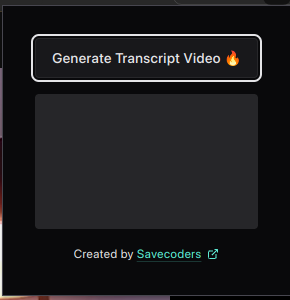
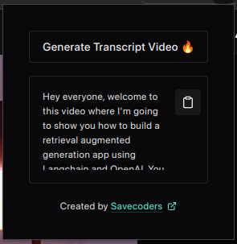

# YTranscripts

A Chrome/Firefox browser extension (Manifest V3) that extracts YouTube video transcripts and generates AI-powered Mermaid.js concept map diagrams. View, edit, copy, and export transcripts and diagrams from a dashboard that replaces your new-tab page.

## Features

- **Transcript Extraction** — One-click transcript capture from any YouTube video via the extension popup
- **AI Diagram Generation** — Generate Mermaid.js concept maps from transcripts using Google Gemini AI (`gemini-2.5-flash-lite`)
- **Monaco Editor** — Edit generated Mermaid diagram code with full syntax support
- **Diagram Export** — Export diagrams as PNG, SVG, or PDF with configurable background and resolution
- **Transcript History** — Browse and manage up to 50 saved transcripts from the dashboard
- **Dark/Light Mode** — Theme switching via next-themes
- **Internationalization** — Full English and Spanish language support (i18next)
- **Cross-Browser** — Adapter pattern supports Chrome and Firefox APIs

## Screenshots




## Tech Stack

| Technology              | Purpose                         |
| ----------------------- | ------------------------------- |
| TypeScript (~5.6)       | Language                        |
| Preact (10.28)          | UI framework (aliased as React) |
| Chakra UI v3            | Component library               |
| Zustand (5.x)           | State management                |
| Vite (5.x)              | Build tool                      |
| @crxjs/vite-plugin      | Extension bundling              |
| Google Gemini AI        | Diagram generation              |
| Mermaid.js              | Diagram rendering               |
| Monaco Editor           | Code editor                     |
| i18next + react-i18next | Internationalization            |
| Vitest (4.x)            | Unit testing                    |
| pnpm                    | Package manager                 |

## Installation

### From Source

```bash
# Clone the repository
git clone https://github.com/Savecoders/YTranscripts.git
cd YTranscripts

# Install dependencies
pnpm install

# Build for production
pnpm run build
```

### Load in Chrome

1. Open `chrome://extensions`
2. Enable **Developer mode**
3. Click **Load unpacked** and select the `dist/` folder

### Load in Firefox

1. Open `about:debugging#/runtime/this-firefox`
2. Click **Load Temporary Add-on**
3. Select any file inside the `dist/` folder

## Usage

1. Navigate to a YouTube video
2. Click the YTranscripts extension icon
3. Click **Get Transcript** to extract the video transcript
4. Open a new tab to access the dashboard with your saved transcripts
5. Click **Generate** on any transcript to create an AI-powered Mermaid diagram
6. Edit the diagram code in Monaco Editor, export as PNG/SVG/PDF, or copy to clipboard

> **Note:** Diagram generation requires a Google Gemini API key. Configure it in **Settings** from the dashboard.

## Development

```bash
pnpm run dev          # Start Vite dev server with HMR
pnpm run build        # TypeScript check + Vite production build
pnpm run lint         # Run ESLint
pnpm run preview      # Preview production build
```

### Testing

The project uses Vitest with jsdom and @testing-library/preact. There are **84 unit tests** across 7 test files covering services, store, utilities, and i18n configuration.

```bash
pnpm run test         # Run all tests once
pnpm run test:watch   # Run tests in watch mode
pnpm run test:coverage # Run tests with coverage report
```

## Architecture

```
┌─────────────────────────────────────────────────────────┐
│  Pages (Popup + Dashboard)                              │
├─────────────────────────────────────────────────────────┤
│  Store (Zustand — history, CRUD, optimistic updates)    │
├─────────────────────────────────────────────────────────┤
│  Services                                               │
│  BrowserAdapter (Chrome/Firefox) | StorageService       │
│  GeminiService | DiagramExporter + ExportBuilder        │
├─────────────────────────────────────────────────────────┤
│  Content Script (YouTube DOM transcript extraction)     │
└─────────────────────────────────────────────────────────┘
```

## License

[MIT](./LICENSE)
